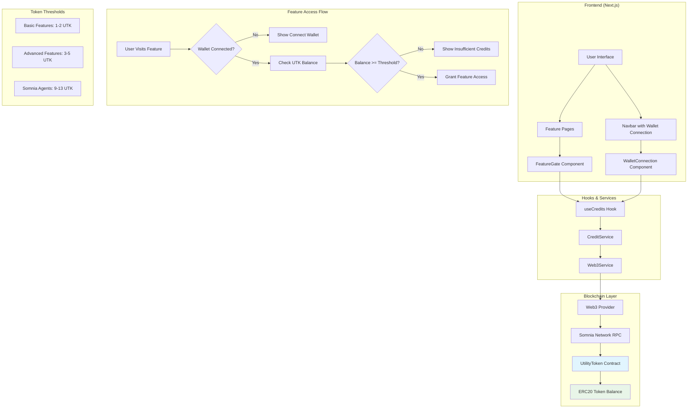
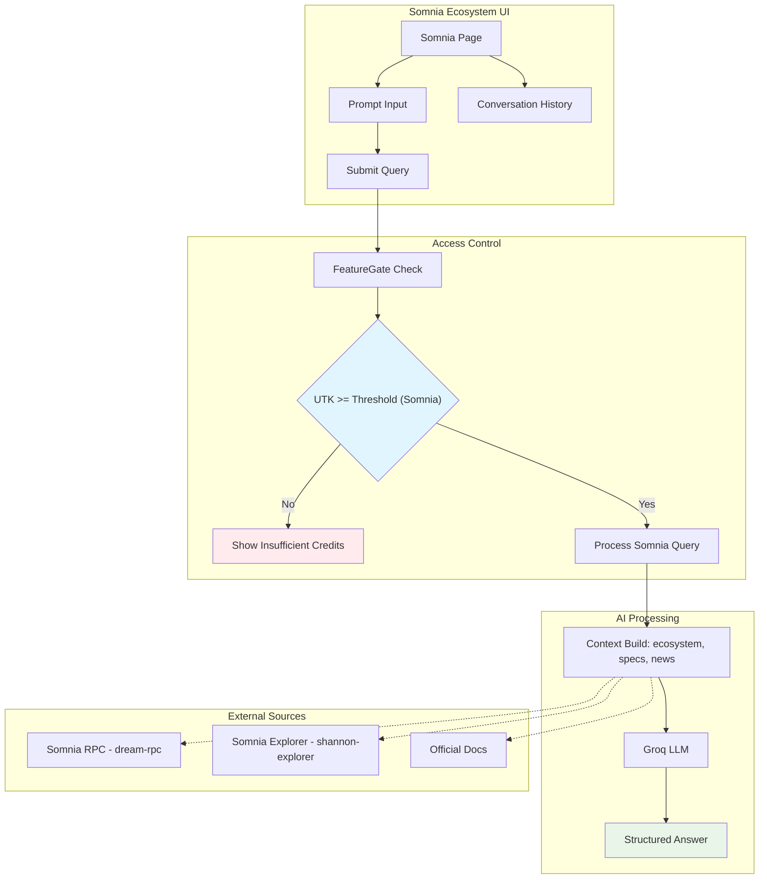
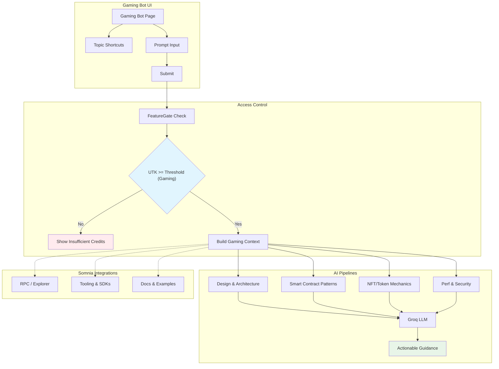
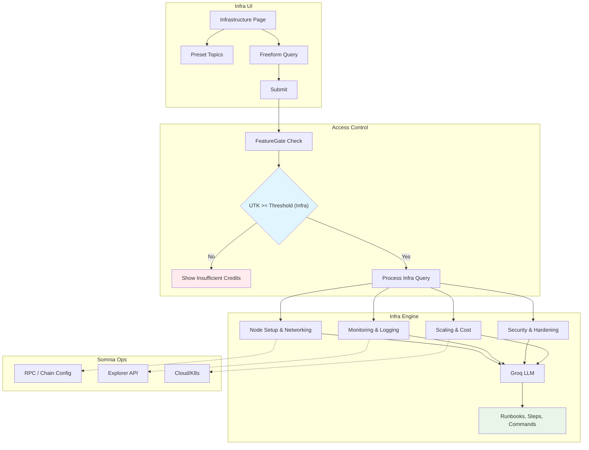
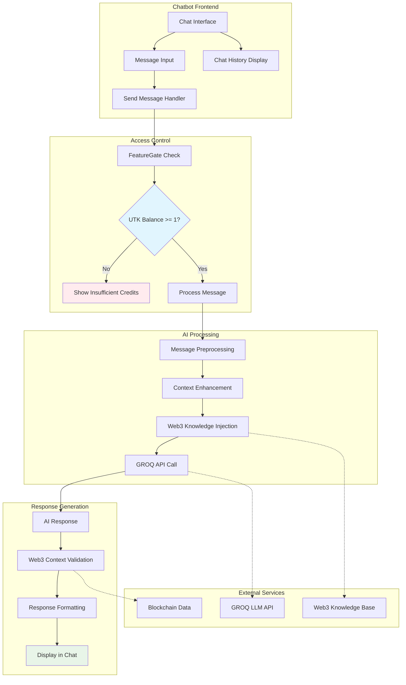
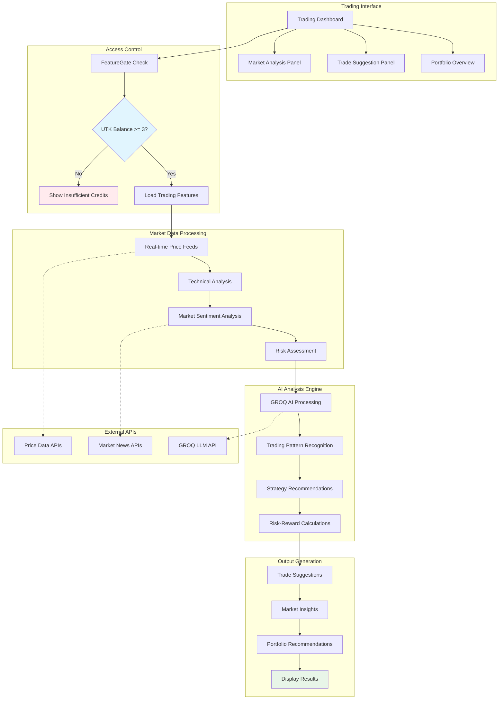
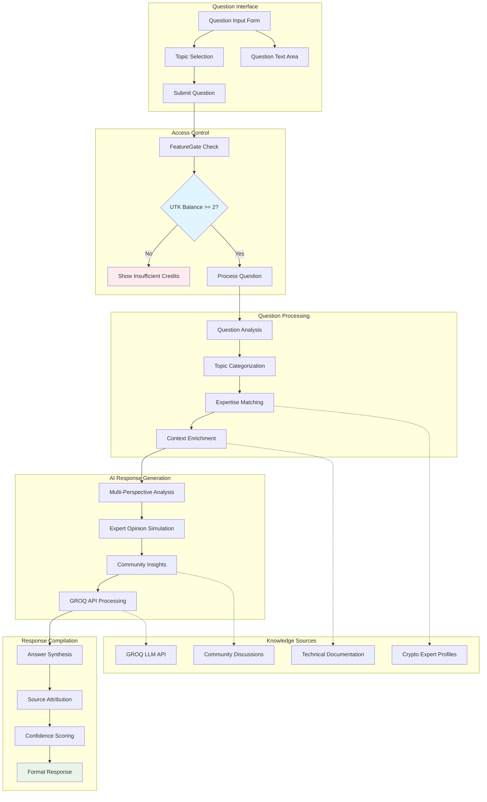
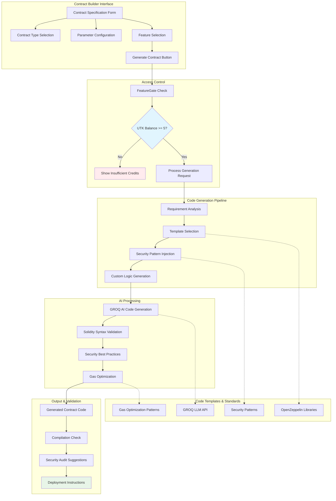
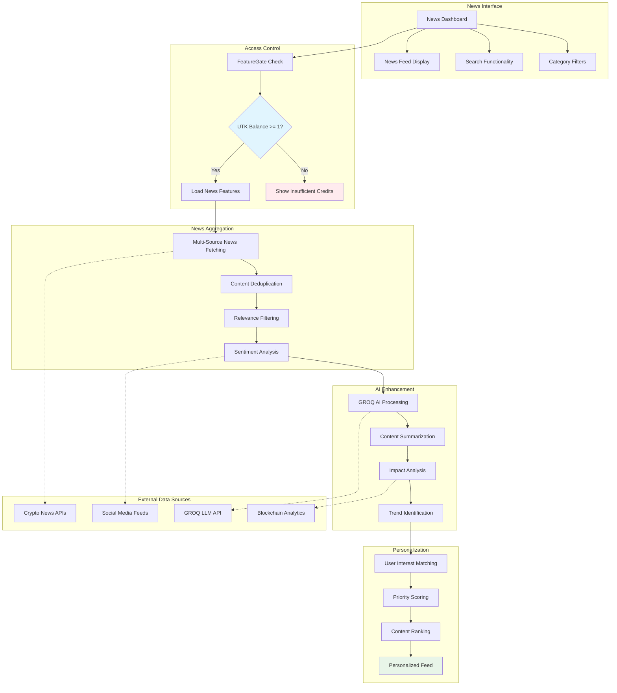
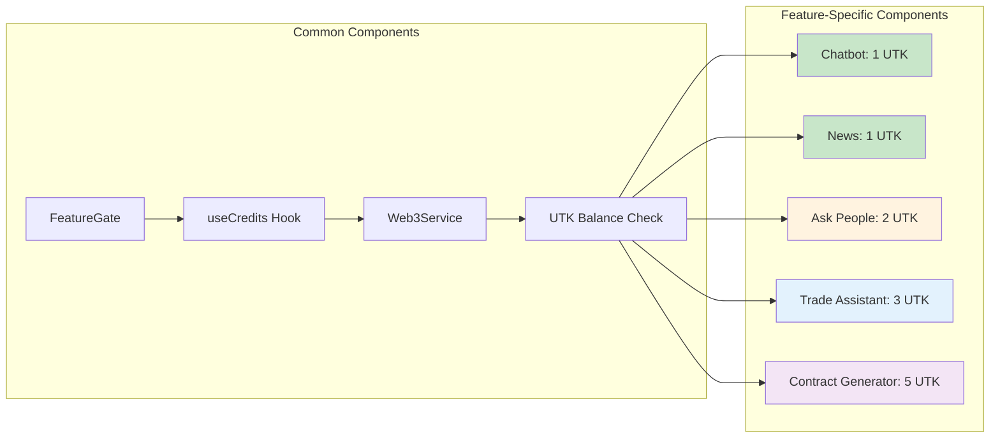

# Sage AI - Your Intelligent Web3 Assistant Platform

## Overview
Sage AI is a comprehensive Web3-powered AI platform natively built for the Somnia blockchain ecosystem. The platform combines artificial intelligence with blockchain technology to provide a suite of intelligent tools and services. Using an ERC20 utility token (UTK) to gate features based on user token balance, Sage AI ensures fair access to premium features while maintaining a sustainable ecosystem. Currently live on Somnia Testnet with seamless integration to Somnia's high-performance infrastructure.

## Key Features

### 🌟 Somnia Native Agents (Priority)
- **Somnia Ecosystem Explorer**: AI-powered agent specializing in Somnia ecosystem knowledge, network context, and guidance (9 UTK)
- **Gaming Development Bot**: Expert assistant for game design, NFT/token mechanics, and smart contract patterns on Somnia (11 UTK)
- **Infrastructure Agents**: Comprehensive runbooks and guidance for node setup, monitoring, security, and scaling on Somnia (13 UTK)

### 🤖 AI-Powered Tools
- **Chatbot**: General-purpose Web3 AI assistant with contextual knowledge (1 UTK)
- **News Insights**: Real-time aggregation and AI analysis of blockchain and crypto news (1 UTK)
- **Ask People**: Community-style Q&A platform with AI moderation and expert simulation (2 UTK)
- **Trade Assistant**: AI-powered trading insights, risk assessment, and market strategies (3 UTK)
- **Smart Contract Generator**: Automated Solidity code generation with security best practices (5 UTK)

### 🔐 Security & Access Control
- Web3 wallet integration for secure authentication via MetaMask and compatible wallets
- Token-based access control system with transparent on-chain verification
- ERC20 UTK token gating for fair and transparent feature access
- Somnia Testnet integration with faucet for easy token claiming

## Technology Stack

- **Frontend**: Next.js 13+, TypeScript, TailwindCSS
- **Blockchain**: Solidity, Hardhat, Web3.js, Somnia Network
- **AI/ML**: Groq LLM API
- **UI Components**: Radix UI, Shadcn
- **Authentication**: Web3 Wallet Integration (MetaMask compatible)
- **State Management**: React Hooks
- **Testing**: Hardhat Test Suite


### Blockchain Configuration
```bash
# RPC URL for your blockchain network
NEXT_PUBLIC_RPC_URL="https://dream-rpc.somnia.network/"

# Blockchain explorer URL for transaction viewing
NEXT_PUBLIC_EXPLORER_URL="https://shannon-explorer.somnia.network/"

# Somnia network chain ID (Testnet)
NEXT_PUBLIC_CHAIN_ID="50312"

# Faucet contract (for UTK claims)
NEXT_PUBLIC_FAUCET_ADDRESS="0x16061b1ac83ceb587B76Ceb5ad19e67067768C73"

# Your deployed UtilityToken contract address
NEXT_PUBLIC_UTILITY_TOKEN_ADDRESS="0x8270bc03a46ADC2b21EAB599cF077Ce16Af9f5cb"
```

## Getting Started

### Prerequisites
- Node.js 16.x or later
- Git
- Web3 wallet (MetaMask recommended)
- Yarn or npm

### Installation

1. Clone the repository
```bash
git clone https://github.com/Ujjwal-sinha/SageAi-.git
cd sageai
```

2. Install dependencies
```bash
yarn install
# or
npm install
```

3. Set up environment variables by creating a `.env.local` file in the root directory:

```bash
# Somnia Network Configuration
NEXT_PUBLIC_RPC_URL="https://dream-rpc.somnia.network/"
NEXT_PUBLIC_EXPLORER_URL="https://shannon-explorer.somnia.network/"
NEXT_PUBLIC_CHAIN_ID=50312
NEXT_PUBLIC_FAUCET_ADDRESS=0x16061b1ac83ceb587B76Ceb5ad19e67067768C73
# Utility Token Configuration
NEXT_PUBLIC_UTILITY_TOKEN_ADDRESS=0x8270bc03a46ADC2b21EAB599cF077Ce16Af9f5cb
# CoinMarketCap API Configuration (Required for real crypto data)
# Get your API key from: https://coinmarketcap.com/api/
COINMARKETCAP_API_KEY=your_coinmarketcap_api_key_here

# Groq API Configuration (Required for AI features)
NEXT_PUBLIC_GROQ_API_KEY=your_groq_api_key_here


# Credit Thresholds (Optional - defaults will be used if not set)
NEXT_PUBLIC_THRESHOLD_CHATBOT=1
NEXT_PUBLIC_THRESHOLD_CONTRACT_GENERATOR=5
NEXT_PUBLIC_THRESHOLD_TRADE_ASSISTANT=3
NEXT_PUBLIC_THRESHOLD_ASK_PEOPLE=2
NEXT_PUBLIC_THRESHOLD_NFT_GENERATOR=10
NEXT_PUBLIC_THRESHOLD_BLOCKCHAIN_ARCHITECT=15
NEXT_PUBLIC_THRESHOLD_DEFI_DESIGNER=20
NEXT_PUBLIC_THRESHOLD_TOKEN_DESIGNER=8
NEXT_PUBLIC_THRESHOLD_NEWS_INSIGHTS=1
NEXT_PUBLIC_THRESHOLD_PREMIUM_ANALYTICS=25
NEXT_PUBLIC_THRESHOLD_SOMNIA_ECOSYSTEM=9
NEXT_PUBLIC_THRESHOLD_GAMING_BOT=11
NEXT_PUBLIC_THRESHOLD_INFRASTRUCTURE_AGENTS=13
```

**Note**: The CoinMarketCap API key is required for real crypto data. Without it, the dashboard will show empty sections with appropriate messages.

## How It Works

1. **Token Contract**: Deploy the UtilityToken.sol contract to your blockchain
2. **Feature Gating**: Each feature is wrapped with a `FeatureGate` component
3. **Balance Checking**: The system checks user's UTK balance via Web3 calls
4. **Access Control**: Users can only access features if their balance meets the threshold

## Architecture Diagram



## Somnia Network Setup

- Network Name: Somnia Testnet
- RPC URL: https://dream-rpc.somnia.network
- Chain ID: 50312
- Currency Symbol: SOM
- Block Explorer: https://shannon-explorer.somnia.network

Notes:
- You need a small amount of SOM for gas to claim UTK from the faucet.
- Ensure your wallet is connected to Somnia Testnet before using `/claim`.

## Feature-Specific Architecture Diagrams

### Somnia Agents Architecture (Priority)

#### Somnia Ecosystem Agent



#### Gaming Development Agent (Somnia)



#### Infrastructure Agents (Somnia)




### 1. Web3 AI Chatbot Architecture (1 UTK Required)



### 2. Trading Assistant Architecture (3 UTK Required)



### 3. Ask Crypto People Architecture (2 UTK Required)



### 4. AI Smart Contract Generator Architecture (5 UTK Required)



### 5. AI Web3 News Architecture (1 UTK Required)



### Feature Integration Flow


```

### System Flow Steps

1. **User Authentication**
   - User connects MetaMask or compatible wallet
   - System detects wallet address and network

2. **Balance Verification**
   - Web3Service queries UtilityToken contract
   - Retrieves current UTK balance for user address
   - Caches balance for performance

3. **Feature Access Control**
   - FeatureGate component wraps each premium feature
   - Compares user balance against feature threshold
   - Grants or denies access based on token holdings

4. **Real-time Updates**
   - Balance updates when user performs transactions
   - UI reflects current access permissions
   - Automatic refresh on wallet events

5. **Transaction Monitoring**
   - Links to Somnia Explorer for transaction history
   - Real-time balance updates after token transfers
   - Error handling for network issues
``` 
## Project Structure

```
├── app/                  # Next.js application pages
├── components/           # Reusable UI components
├── contracts/           # Smart contract source files
├── hooks/              # Custom React hooks
├── lib/                # Utility functions and services
├── public/             # Static assets
├── scripts/            # Deployment and utility scripts
├── test/              # Test files
└── types/             # TypeScript type definitions
```
## Usage

### Deploy Token Contract
```bash
npx hardhat run scripts/deploy.js --network primordial
```

### Wrap Features with FeatureGate
```typescript
import { FeatureGate } from '@/components/FeatureGate';
import { FeatureType } from '@/lib/services/creditService';

export default function MyFeaturePage() {
  return (
    <FeatureGate feature={FeatureType.CHATBOT}>
      <MyFeatureContent />
    </FeatureGate>
  );
}
```

### Check User Credits Programmatically
```typescript
import { useCredits } from '@/hooks/useCredits';

function MyComponent() {
  const { credits, checkFeatureAccess } = useCredits();
  
  const handleAction = async () => {
    const access = await checkFeatureAccess(FeatureType.SMART_CONTRACT_GENERATOR);
    if (access.hasAccess) {
      // User has sufficient credits
    } else {
      // Show insufficient credits message
    }
  };
}
```

## Components

- **FeatureGate**: Wraps features and blocks access if insufficient credits
- **WalletConnection**: Shows wallet status and UTK balance in navbar
- **Web3Service**: Handles blockchain interactions and token balance checking
- **CreditService**: Manages feature access logic and thresholds

## Features Implemented

All feature pages now have token-gated access:
- ✅ AI Chatbot (`/chatbot`) - 1 UTK
- ✅ Smart Contract Generator (`/contract`) - 5 UTK  
- ✅ Trading Assistant (`/tradeassistant`) - 3 UTK
- ✅ Ask Crypto People (`/askpeople`) - 2 UTK
- ✅ Web3 News AI (`/news`) - 1 UTK
 - ✅ Somnia Ecosystem Explorer (`/somnia`) - 9 UTK
 - ✅ Gaming Development Bot (`/gamingbot`) - 11 UTK
 - ✅ Infrastructure Agents (`/infrastructure`) - 13 UTK
 - ✅ Token Faucet Claim (`/claim`) - Claim 100 UTK (requires SOM gas)
 