# Sage AI - Your Intelligent Web3 Assistant Platform

## Overview
Sage AI is a comprehensive Web3-powered AI platform that combines artificial intelligence with blockchain technology to provide a suite of intelligent tools and services. The platform uses an ERC20 utility token (UTK) to gate features based on user token balance, ensuring fair access to premium features while maintaining a sustainable ecosystem.

## Key Features

### 🤖 AI-Powered Tools
- **Chatbot**: Intelligent conversational AI for general assistance
- **News Insights**: Real-time analysis of blockchain and crypto news
- **Ask People**: Community-driven Q&A platform with AI moderation
- **Trade Assistant**: AI-powered trading insights and analysis
- **Contract Generator**: Automated smart contract creation and validation

### 💎 Premium Features
- **Token Designer**: Advanced token creation and tokenomics planning
- **NFT Generator**: AI-assisted NFT creation and metadata management
- **Blockchain Architect**: Infrastructure planning and optimization tools
- **DeFi Designer**: Automated DeFi protocol design and analysis
- **Premium Analytics**: Advanced market insights and predictions

### 🔐 Security & Access Control
- Web3 wallet integration for secure authentication
- Token-based access control system
- Transparent and immutable feature access rules
- Fair pricing model based on feature utility

## Technology Stack

- **Frontend**: Next.js 13+, TypeScript, TailwindCSS
- **Blockchain**: Solidity, Hardhat, Web3.js
- **AI/ML**: Groq, Grok
- **UI Components**: Radix UI, Shadcn
- **Authentication**: Web3 Wallet Integration
- **State Management**: React Hooks
- **Testing**: Hardhat Test Suite


### Blockchain Configuration
```bash
# RPC URL for your blockchain network
NEXT_PUBLIC_RPC_URL="https://dream-rpc.somnia.network/"

# Blockchain explorer URL for transaction viewing
NEXT_PUBLIC_EXPLORER_URL="https://shannon-explorer.somnia.network/"

# Your deployed UtilityToken contract address
NEXT_PUBLIC_UTILITY_TOKEN_ADDRESS="0x0921887D1658f93BFB7fF93aB1487eb688248E32"
```

## Getting Started

### Prerequisites
- Node.js 16.x or later
- Git
- Web3 wallet (MetaMask recommended)
- Yarn or npm

### Installation

1. Clone the repository
```bash
git clone https://github.com/Ujjwal-sinha/SageAi-.git
cd sageai
```

2. Install dependencies
```bash
yarn install
# or
npm install
```

3. Set up environment variables by creating a `.env.local` file in the root directory.

### Development

```bash
# Run development server
yarn dev
# or
npm run dev

# Build for production
yarn build
# or
npm run build

# Run tests
yarn test
# or
npm test
```

## Environment Variables

Create a `.env.local` file in the root directory with the following variables:


### Feature Credit Thresholds (in UTK tokens)
```bash
# Basic features
NEXT_PUBLIC_THRESHOLD_CHATBOT=1
NEXT_PUBLIC_THRESHOLD_NEWS_INSIGHTS=1
NEXT_PUBLIC_THRESHOLD_ASK_PEOPLE=2

# Advanced features  
NEXT_PUBLIC_THRESHOLD_CONTRACT_GENERATOR=5
NEXT_PUBLIC_THRESHOLD_TRADE_ASSISTANT=3
NEXT_PUBLIC_THRESHOLD_TOKEN_DESIGNER=8

# Premium features
NEXT_PUBLIC_THRESHOLD_NFT_GENERATOR=10
NEXT_PUBLIC_THRESHOLD_BLOCKCHAIN_ARCHITECT=15
NEXT_PUBLIC_THRESHOLD_DEFI_DESIGNER=20
NEXT_PUBLIC_THRESHOLD_PREMIUM_ANALYTICS=25
```

### Existing API Keys
```bash
# AI/LLM API keys
NEXT_PUBLIC_GROQ_API_KEY=your_groq_api_key
NEXT_PUBLIC_GROQTA_API_KEY=your_groqta_api_key
GROK_API_KEY=your_grok_api_key

# Deployment
DEPLOYER_PRIVATE_KEY=your_deployer_private_key
```

## How It Works

1. **Token Contract**: Deploy the UtilityToken.sol contract to your blockchain
2. **Feature Gating**: Each feature is wrapped with a `FeatureGate` component
3. **Balance Checking**: The system checks user's UTK balance via Web3 calls
4. **Access Control**: Users can only access features if their balance meets the threshold

## Architecture Diagram


## Project Structure

```
├── app/                  # Next.js application pages
├── components/           # Reusable UI components
├── contracts/           # Smart contract source files
├── hooks/              # Custom React hooks
├── lib/                # Utility functions and services
├── public/             # Static assets
├── scripts/            # Deployment and utility scripts
├── test/              # Test files
└── types/             # TypeScript type definitions
```

## Contributing

We welcome contributions to Sage AI! Please follow these steps:

1. Fork the repository
2. Create a feature branch (`git checkout -b feature/amazing-feature`)
3. Commit your changes (`git commit -m 'Add amazing feature'`)
4. Push to the branch (`git push origin feature/amazing-feature`)
5. Open a Pull Request

### Contribution Guidelines

- Write clear, descriptive commit messages
- Follow the existing code style and conventions
- Add/update tests for any new features
- Update documentation as needed
- Ensure all tests pass before submitting PRs

## Support

For support, please:
- Open an issue on GitHub
- Join our Discord community
- Check the documentation
- Contact our support team

## License

This project is licensed under the MIT License - see the [LICENSE](LICENSE) file for details.

---

Built with ❤️ by the Sage AI Team
    style S fill:#e8f5e8
    style R fill:#ffebee
```

### System Flow Steps

1. **User Authentication**
   - User connects MetaMask or compatible wallet
   - System detects wallet address and network

2. **Balance Verification**
   - Web3Service queries UtilityToken contract
   - Retrieves current UTK balance for user address
   - Caches balance for performance

3. **Feature Access Control**
   - FeatureGate component wraps each premium feature
   - Compares user balance against feature threshold
   - Grants or denies access based on token holdings

4. **Real-time Updates**
   - Balance updates when user performs transactions
   - UI reflects current access permissions
   - Automatic refresh on wallet events

5. **Transaction Monitoring**
   - Links to Somnia Explorer for transaction history
   - Real-time balance updates after token transfers
   - Error handling for network issues
``` 
## Feature-Specific Architecture Diagrams

### 1. Web3 AI Chatbot Architecture (1 UTK Required)


### 2. Trading Assistant Architecture (3 UTK Required)


### 3. Ask Crypto People Architecture (2 UTK Required)


### 4. AI Smart Contract Generator Architecture (5 UTK Required)


### 5. AI Web3 News Architecture (1 UTK Required)

```mermaid
graph TB
    subgraph "News Interface"
        A[News Dashboard] --> B[Category Filters]
        A --> C[Search Functionality]
        A --> D[News Feed Display]
    end
    
    subgraph "Access Control"
        A --> E[FeatureGate Check]
        E --> F{UTK Balance >= 1?}
        F -->|No| G[Show Insufficient Credits]
        F -->|Yes| H[Load News Features]
    end
    
    subgraph "News Aggregation"
        H --> I[Multi-Source News Fetching]
        I --> J[Content Deduplication]
        J --> K[Relevance Filtering]
        K --> L[Sentiment Analysis]
    end
    
    subgraph "AI Enhancement"
        L --> M[GROQ AI Processing]
        M --> N[Content Summarization]
        N --> O[Impact Analysis]
        O --> P[Trend Identification]
    end
    
    subgraph "Personalization"
        P --> Q[User Interest Matching]
        Q --> R[Priority Scoring]
        R --> S[Content Ranking]
        S --> T[Personalized Feed]
    end
    
    subgraph "External Data Sources"
        U[Crypto News APIs]
        V[Social Media Feeds]
        W[Blockchain Analytics]
        X[GROQ LLM API]
    end
    
    I -.-> U
    L -.-> V
    O -.-> W
    M -.-> X
    
    style F fill:#e1f5fe
    style G fill:#ffebee
    style T fill:#e8f5e8
```



### Feature Integration Flow


## Usage

### Deploy Token Contract
```bash
npx hardhat run scripts/deploy.js --network primordial
```

### Wrap Features with FeatureGate
```typescript
import { FeatureGate } from '@/components/FeatureGate';
import { FeatureType } from '@/lib/services/creditService';

export default function MyFeaturePage() {
  return (
    <FeatureGate feature={FeatureType.CHATBOT}>
      <MyFeatureContent />
    </FeatureGate>
  );
}
```

### Check User Credits Programmatically
```typescript
import { useCredits } from '@/hooks/useCredits';

function MyComponent() {
  const { credits, checkFeatureAccess } = useCredits();
  
  const handleAction = async () => {
    const access = await checkFeatureAccess(FeatureType.SMART_CONTRACT_GENERATOR);
    if (access.hasAccess) {
      // User has sufficient credits
    } else {
      // Show insufficient credits message
    }
  };
}
```

## Components

- **FeatureGate**: Wraps features and blocks access if insufficient credits
- **WalletConnection**: Shows wallet status and UTK balance in navbar
- **Web3Service**: Handles blockchain interactions and token balance checking
- **CreditService**: Manages feature access logic and thresholds

## Features Implemented

All feature pages now have token-gated access:
- ✅ AI Chatbot (`/chatbot`) - 1 UTK
- ✅ Smart Contract Generator (`/contract`) - 5 UTK  
- ✅ Trading Assistant (`/tradeassistant`) - 3 UTK
- ✅ Ask Crypto People (`/askpeople`) - 2 UTK
- ✅ Web3 News AI (`/news`) - 1 UTK

Future features will automatically use the same system by wrapping with `FeatureGate`. 